# Netflix Distributed Counter System Design - Comprehensive Knowledge Base

## Table of Contents
1. [Executive Summary](#executive-summary)
2. [Problem Statement](#problem-statement)
3. [System Requirements](#system-requirements)
4. [Architecture Overview](#architecture-overview)
5. [Core Components](#core-components)
6. [Counting Strategies](#counting-strategies)
7. [Netflix's Hybrid Approach](#netflixs-hybrid-approach)
8. [Implementation Details](#implementation-details)
9. [Performance Characteristics](#performance-characteristics)
10. [Trade-offs and Design Decisions](#trade-offs-and-design-decisions)
11. [Operational Excellence](#operational-excellence)
12. [Interview Deep Dive Questions](#interview-deep-dive-questions)
13. [Alternative Approaches](#alternative-approaches)
14. [Production Considerations](#production-considerations)
15. [Lessons Learned](#lessons-learned)

---

## Executive Summary

Netflix built a sophisticated **Distributed Counter Abstraction** to handle billions of user interactions daily while maintaining low latency (single-digit milliseconds) and high throughput (75,000+ requests/second globally). The system combines multiple counting strategies through a unified API, leveraging Netflix's TimeSeries abstraction and Data Gateway platform to provide both fast approximate counts and eventually consistent accurate counts.

### Key Achievements:
- **75,000+ counter requests/second** globally
- **Single-digit millisecond latency** for API endpoints
- **High availability** across multiple regions
- **Idempotent operations** preventing double-counting
- **Flexible consistency models** for different use cases

---

## Problem Statement

### Business Context
Netflix operates at massive scale with millions of users generating billions of interactions:
- **Content views** and engagement metrics
- **A/B testing** experiment tracking
- **Feature usage** analytics
- **Billing and compliance** metrics
- **Real-time dashboards** for business decisions

### Technical Challenges
1. **Scale**: Millions of events per second globally
2. **Latency**: Real-time requirements for user experience
3. **Accuracy**: Critical business metrics need precision
4. **Reliability**: System failures cannot lose counter data
5. **Cost**: Infrastructure costs must be optimized
6. **Flexibility**: Different use cases need different guarantees

### Traditional Solutions Fall Short
- **Single database**: Cannot handle the scale
- **Simple caching**: Loses data on failures
- **Sharded counters**: Complex coordination overhead
- **Event sourcing**: High storage costs and read latency

---

## System Requirements

### Functional Requirements
- **AddCount/AddAndGetCount**: Increment/decrement counters with immediate response
- **GetCount**: Retrieve current counter values
- **ClearCount**: Reset counters to zero
- **Namespace isolation**: Multi-tenant support
- **Idempotency**: Safe retry handling

### Non-Functional Requirements

| Requirement | Target | Justification |
|-------------|--------|---------------|
| **Latency** | < 10ms P99 | Real-time user experience |
| **Throughput** | 75K+ RPS | Global scale operations |
| **Availability** | 99.99% | Critical business systems |
| **Consistency** | Configurable | Different use cases need different guarantees |
| **Durability** | No data loss | Business-critical metrics |
| **Cost** | Optimized | Large-scale operations |

---

## Architecture Overview

### System Architecture Diagram
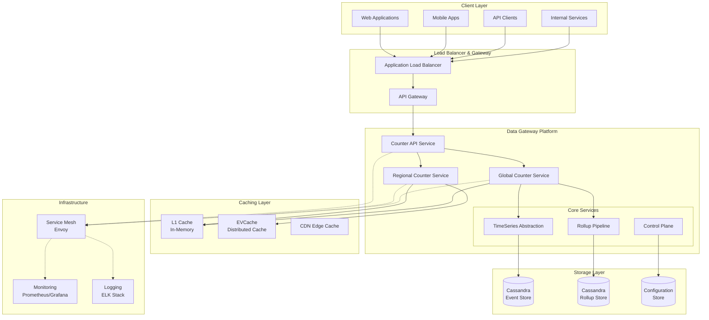

### Data Flow Architecture
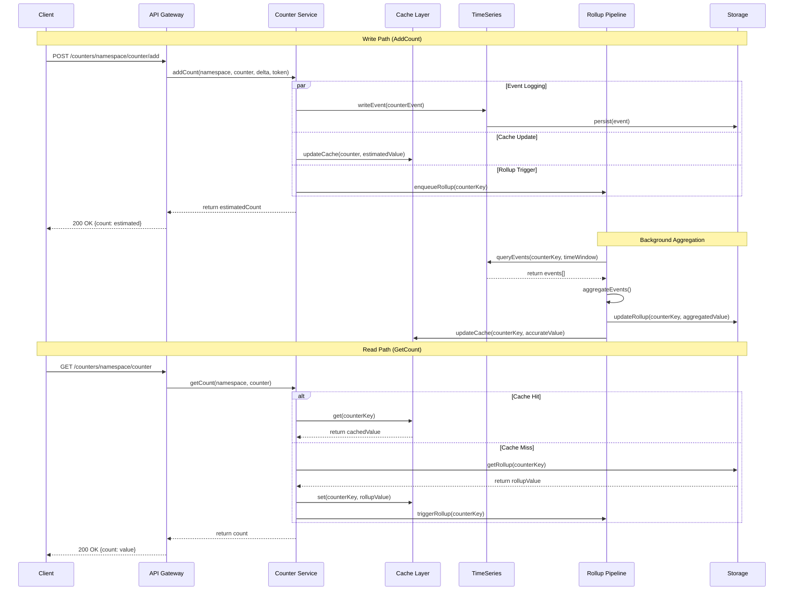

### Regional Distribution Architecture
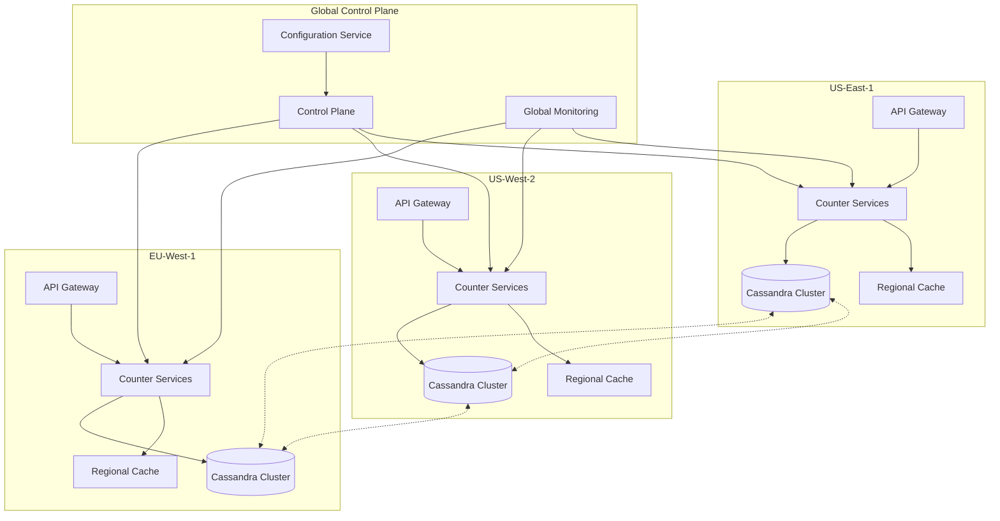

### Key Architectural Principles
1. **Layered abstraction** hiding complexity from clients
2. **Pluggable storage engines** for different consistency needs
3. **Centralized control plane** for configuration management
4. **Event-driven architecture** for loose coupling
5. **Multi-region deployment** for global scale

---

## Core Components

### 1. Counter API Gateway
```java
// Example API interface
@RestController
@RequestMapping("/api/v1/counters")
public class CounterAPI {
    
    @Autowired
    private CounterService counterService;
    
    @PostMapping("/{namespace}/{counterName}/add")
    public ResponseEntity<CounterResponse> addCount(
            @PathVariable String namespace,
            @PathVariable String counterName,
            @RequestBody AddCountRequest request) {
        
        long newValue = counterService.addCount(
            namespace, counterName, request.getDelta(), request.getIdempotencyToken());
        return ResponseEntity.ok(new CounterResponse(newValue));
    }
    
    @GetMapping("/{namespace}/{counterName}")
    public ResponseEntity<CounterResponse> getCount(
            @PathVariable String namespace,
            @PathVariable String counterName) {
        
        long value = counterService.getCount(namespace, counterName);
        return ResponseEntity.ok(new CounterResponse(value));
    }
    
    @PostMapping("/{namespace}/{counterName}/clear")
    public ResponseEntity<Void> clearCount(
            @PathVariable String namespace,
            @PathVariable String counterName,
            @RequestBody ClearCountRequest request) {
        
        counterService.clearCount(namespace, counterName, request.getIdempotencyToken());
        return ResponseEntity.ok().build();
    }
}
```

**Key Features:**
- Unified API across different counting strategies
- Built-in authentication and authorization
- Request routing to appropriate backend
- Circuit breaker and rate limiting

### 2. TimeSeries Abstraction Layer
```json
{
  "event_time": "2025-01-28T14:48:00Z",
  "event_id": "unique_event_id_12345",
  "event_item_key": "user_metrics.views_counter",
  "delta": 5,
  "source": "service_instance_42"
}
```

**Core Capabilities:**
- High-performance temporal data storage
- Time-bucketed organization to prevent wide partitions
- Built-in deduplication via event_id
- Efficient range queries for aggregation

### 3. Rollup Pipeline
```java
@Component
public class RollupPipeline {
    
    private final Map<Integer, Set<String>> inMemoryQueues = new ConcurrentHashMap<>();
    private final BatchProcessor batchProcessor;
    private final TimeSeriesService timeSeriesService;
    private final RollupStore rollupStore;
    
    @Autowired
    public RollupPipeline(BatchProcessor batchProcessor, 
                         TimeSeriesService timeSeriesService,
                         RollupStore rollupStore) {
        this.batchProcessor = batchProcessor;
        this.timeSeriesService = timeSeriesService;
        this.rollupStore = rollupStore;
    }
    
    public void enqueueRollupEvent(String counterKey) {
        int queueHash = hashFunction(counterKey);
        inMemoryQueues.computeIfAbsent(queueHash, k -> ConcurrentHashMap.newKeySet())
                     .add(counterKey);
    }
    
    @Async
    public CompletableFuture<Void> processBatch(Set<String> counterKeys) {
        return CompletableFuture.supplyAsync(() -> {
            List<CounterEvent> events = fetchEventsParallel(counterKeys);
            Map<String, Long> aggregatedCounts = aggregateEvents(events);
            rollupStore.storeRollups(aggregatedCounts);
            return null;
        });
    }
    
    private List<CounterEvent> fetchEventsParallel(Set<String> counterKeys) {
        return counterKeys.parallelStream()
                .flatMap(key -> timeSeriesService.getEvents(key).stream())
                .collect(Collectors.toList());
    }
    
    private int hashFunction(String key) {
        return Math.abs(key.hashCode()) % 100; // 100 queues
    }
}
```

**Key Features:**
- In-memory queues for low latency
- Dynamic batching based on system load
- Back-pressure mechanisms
- Parallel processing for multiple counters

### 4. Data Gateway Control Plane
```yaml
# Example configuration
counter_config:
  namespace: "user_metrics"
  cardinality: "high"
  consistency_model: "eventually_consistent"
  storage_engines:
    - type: "CASSANDRA"
      cluster: "cass_dgw_counter_uc1"
      retention_days: 30
    - type: "EVCACHE"
      cluster: "evcache_dgw_counter_tier1"
      ttl_seconds: 3600
```

---

## Counting Strategies

### 1. Best-Effort Regional Counter

```java
@Service
public class BestEffortCounter implements CounterStrategy {
    
    private final EVCacheClient cacheClient;
    private static final int DEFAULT_TTL = 3600; // 1 hour
    
    @Autowired
    public BestEffortCounter(EVCacheClient cacheClient) {
        this.cacheClient = cacheClient;
    }
    
    @Override
    public long addCount(String key, long delta) {
        Long current = cacheClient.get(key, Long.class).orElse(0L);
        long newValue = current + delta;
        cacheClient.set(key, newValue, DEFAULT_TTL);
        return newValue;
    }
    
    @Override
    public long getCount(String key) {
        return cacheClient.get(key, Long.class).orElse(0L);
    }
    
    @Override
    public void clearCount(String key) {
        cacheClient.delete(key);
    }
}
```

### Best-Effort Counter Architecture
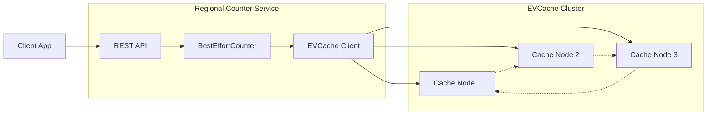

**Use Cases:**
- A/B testing experiments
- Short-lived campaigns
- Approximate analytics

**Pros:**
- Extremely fast (< 1ms latency)
- Cost-effective
- Simple implementation

**Cons:**
- No durability guarantees
- No cross-region consistency
- Not idempotent

### 2. Eventually Consistent Global Counter

#### Single Row Per Counter
```sql
CREATE TABLE counters (
    namespace text,
    counter_name text,
    value bigint,
    updated_at timestamp,
    PRIMARY KEY (namespace, counter_name)
);
```

**Pros:** Simple, consistent reads
**Cons:** Write contention, no idempotency

#### Per Instance Aggregation
```java
@Service
public class PerInstanceCounter {
    
    private final ConcurrentHashMap<String, AtomicLong> localCounts = new ConcurrentHashMap<>();
    private final CounterStorage storage;
    private final ScheduledExecutorService scheduler;
    private static final int FLUSH_INTERVAL_SECONDS = 30;
    
    @Autowired
    public PerInstanceCounter(CounterStorage storage) {
        this.storage = storage;
        this.scheduler = Executors.newScheduledThreadPool(2);
        startPeriodicFlush();
    }
    
    public void addCount(String key, long delta) {
        localCounts.computeIfAbsent(key, k -> new AtomicLong(0))
                  .addAndGet(delta);
    }
    
    @Scheduled(fixedRate = FLUSH_INTERVAL_SECONDS * 1000)
    public void flushToStorage() {
        if (localCounts.isEmpty()) return;
        
        Map<String, Long> snapshot = new HashMap<>();
        localCounts.forEach((key, value) -> {
            long count = value.getAndSet(0);
            if (count != 0) {
                snapshot.put(key, count);
            }
        });
        
        if (!snapshot.isEmpty()) {
            storage.batchIncrement(snapshot);
        }
    }
    
    private void startPeriodicFlush() {
        scheduler.scheduleAtFixedRate(
            this::flushToStorage, 
            FLUSH_INTERVAL_SECONDS, 
            FLUSH_INTERVAL_SECONDS, 
            TimeUnit.SECONDS
        );
    }
}
```

### Per Instance Aggregation Architecture
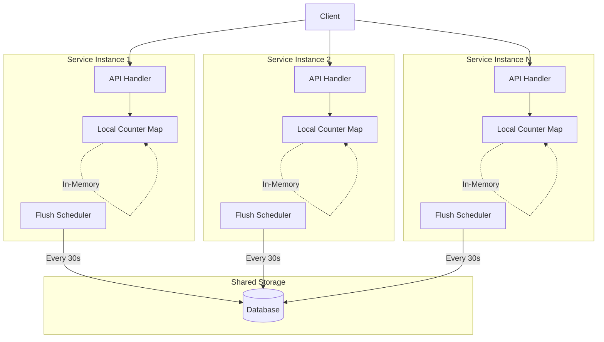

**Pros:** Reduced contention
**Cons:** Data loss risk, synchronization complexity

#### Durable Queues (Kafka)
```java
@Service
public class KafkaCounter {
    
    private final KafkaTemplate<String, CounterEvent> kafkaTemplate;
    private final ObjectMapper objectMapper;
    private static final String TOPIC_NAME = "counter_events";
    private static final int NUM_PARTITIONS = 100;
    
    @Autowired
    public KafkaCounter(KafkaTemplate<String, CounterEvent> kafkaTemplate,
                       ObjectMapper objectMapper) {
        this.kafkaTemplate = kafkaTemplate;
        this.objectMapper = objectMapper;
    }
    
    public CompletableFuture<SendResult<String, CounterEvent>> addCount(
            String key, long delta, String eventId) {
        
        CounterEvent event = CounterEvent.builder()
            .key(key)
            .delta(delta)
            .eventId(eventId)
            .timestamp(Instant.now())
            .build();
            
        int partition = Math.abs(key.hashCode()) % NUM_PARTITIONS;
        
        return kafkaTemplate.send(TOPIC_NAME, partition, key, event)
            .addCallback(
                result -> log.debug("Sent counter event: {}", event),
                failure -> log.error("Failed to send counter event: {}", event, failure)
            );
    }
    
    @KafkaListener(topics = TOPIC_NAME, groupId = "counter-aggregator")
    public void processCounterEvent(CounterEvent event) {
        // Aggregate and store counter events
        counterAggregationService.processEvent(event);
    }
}

@Data
@Builder
public class CounterEvent {
    private String key;
    private long delta;
    private String eventId;
    private Instant timestamp;
    private String source;
}
```

### Kafka-Based Counter Architecture
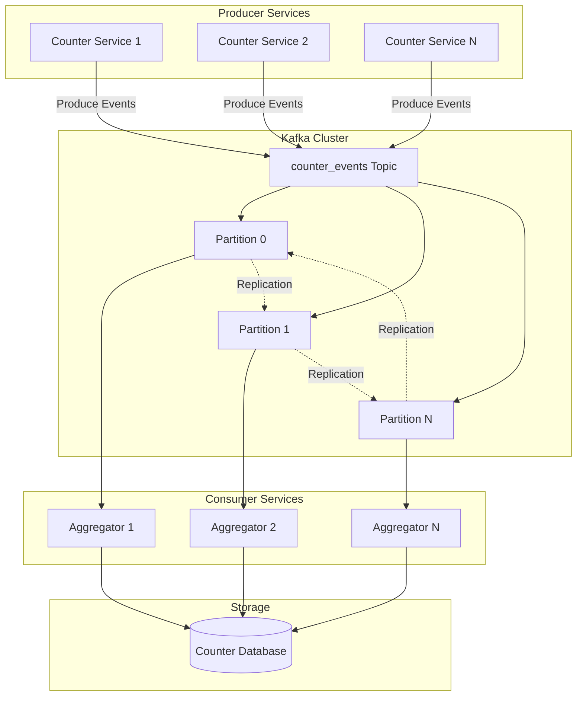

**Pros:** Durability, idempotency, fault tolerance
**Cons:** Latency, consumer lag issues

#### Event Log of Increments
```python
class EventLogCounter:
    def add_count(self, key: str, delta: int, event_id: str):
        event = CounterEvent(
            counter_key=key,
            delta=delta,
            event_id=event_id,
            event_time=datetime.utcnow()
        )
        self.timeseries.write(event)
        
    def get_count(self, key: str) -> int:
        events = self.timeseries.query(
            key=key,
            start_time=datetime.min,
            end_time=datetime.utcnow()
        )
        return sum(event.delta for event in events)
```

**Pros:** Perfect accuracy, full audit trail
**Cons:** High storage cost, slow reads

---

## Netflix's Hybrid Approach

Netflix combines the best aspects of multiple strategies through a sophisticated hybrid system:

### 1. Event Logging + Background Aggregation
```java
@Service
public class HybridCounter implements CounterStrategy {
    
    private final TimeSeriesService timeSeriesService;
    private final RollupPipeline rollupPipeline;
    private final CacheService cacheService;
    private final IdempotencyManager idempotencyManager;
    
    @Autowired
    public HybridCounter(TimeSeriesService timeSeriesService,
                        RollupPipeline rollupPipeline,
                        CacheService cacheService,
                        IdempotencyManager idempotencyManager) {
        this.timeSeriesService = timeSeriesService;
        this.rollupPipeline = rollupPipeline;
        this.cacheService = cacheService;
        this.idempotencyManager = idempotencyManager;
    }
    
    @Override
    @Transactional
    public long addCount(String namespace, String counterName, 
                        long delta, String idempotencyToken) {
        
        // Check for duplicate requests
        if (idempotencyManager.isDuplicate(idempotencyToken)) {
            return idempotencyManager.getCachedResult(idempotencyToken);
        }
        
        String counterKey = String.format("%s.%s", namespace, counterName);
        
        // 1. Log event to TimeSeries
        CounterEvent event = createEvent(namespace, counterName, delta, idempotencyToken);
        timeSeriesService.writeEvent(event);
        
        // 2. Trigger rollup for this counter (async)
        CompletableFuture.runAsync(() -> 
            rollupPipeline.enqueueRollupEvent(counterKey));
        
        // 3. Return cached value + delta estimate
        long cachedValue = cacheService.get(counterKey).orElse(0L);
        long estimatedValue = cachedValue + delta;
        
        // Cache the result for idempotency
        idempotencyManager.markProcessed(idempotencyToken, estimatedValue);
        
        return estimatedValue;
    }
    
    private CounterEvent createEvent(String namespace, String counterName, 
                                   long delta, String idempotencyToken) {
        return CounterEvent.builder()
            .namespace(namespace)
            .counterName(counterName)
            .delta(delta)
            .eventId(idempotencyToken)
            .eventTime(Instant.now())
            .source(getInstanceId())
            .build();
    }
    
    private String getInstanceId() {
        return InetAddress.getLocalHost().getHostName() + "-" + 
               ManagementFactory.getRuntimeMXBean().getName();
    }
}
```

### Netflix Hybrid Architecture
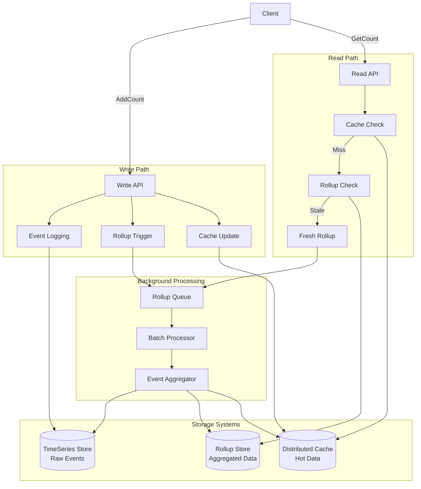

### 2. Immutable Window Aggregation
```java
@Component
public class RollupProcessor {
    
    private final TimeSeriesService timeSeriesService;
    private final RollupStore rollupStore;
    private final CacheService cacheService;
    private final TimeWindowManager timeWindowManager;
    
    @Autowired
    public RollupProcessor(TimeSeriesService timeSeriesService,
                          RollupStore rollupStore,
                          CacheService cacheService,
                          TimeWindowManager timeWindowManager) {
        this.timeSeriesService = timeSeriesService;
        this.rollupStore = rollupStore;
        this.cacheService = cacheService;
        this.timeWindowManager = timeWindowManager;
    }
    
    @Async
    public CompletableFuture<Void> rollupCounter(String counterKey) {
        return CompletableFuture.runAsync(() -> {
            try {
                // Only process events in completed time windows
                Instant currentWindow = timeWindowManager.getCurrentCompletedWindow();
                Instant lastRollup = rollupStore.getLastRollupTimestamp(counterKey)
                    .orElse(Instant.EPOCH);
                
                if (currentWindow.isAfter(lastRollup)) {
                    processRollupWindow(counterKey, lastRollup, currentWindow);
                }
            } catch (Exception e) {
                log.error("Failed to rollup counter: {}", counterKey, e);
                throw new RollupException("Rollup failed for counter: " + counterKey, e);
            }
        });
    }
    
    private void processRollupWindow(String counterKey, Instant startTime, Instant endTime) {
        // Query events within the time window
        List<CounterEvent> events = timeSeriesService.queryEvents(
            counterKey, startTime, endTime);
        
        // Aggregate deltas (deduplication by eventId)
        long totalDelta = events.stream()
            .collect(Collectors.groupingBy(CounterEvent::getEventId))
            .values()
            .stream()
            .mapToLong(eventGroup -> eventGroup.get(0).getDelta()) // Take first for dedup
            .sum();
        
        if (totalDelta != 0) {
            // Update rollup store atomically
            rollupStore.increment(counterKey, totalDelta);
            rollupStore.setLastRollupTimestamp(counterKey, endTime);
            
            // Update cache with latest value
            long newValue = rollupStore.get(counterKey);
            cacheService.set(counterKey, newValue);
            
            log.debug("Rolled up counter {} with delta {} to value {}", 
                     counterKey, totalDelta, newValue);
        }
    }
}

@Component
public class TimeWindowManager {
    private static final Duration WINDOW_SIZE = Duration.ofMinutes(5);
    
    public Instant getCurrentCompletedWindow() {
        Instant now = Instant.now();
        long windowMinutes = WINDOW_SIZE.toMinutes();
        long currentWindowStart = (now.getEpochSecond() / (windowMinutes * 60)) * (windowMinutes * 60);
        return Instant.ofEpochSecond(currentWindowStart).minus(WINDOW_SIZE);
    }
    
    public Instant getWindowStart(Instant timestamp) {
        long windowMinutes = WINDOW_SIZE.toMinutes();
        long windowStart = (timestamp.getEpochSecond() / (windowMinutes * 60)) * (windowMinutes * 60);
        return Instant.ofEpochSecond(windowStart);
    }
}
```

### Immutable Window Processing
```mermaid
gantt
    title Counter Rollup Timeline
    dateFormat  HH:mm
    axisFormat %H:%M
    
    section Window 1 (00:00-00:05)
    Events Arrive     :active, w1events, 00:00, 00:05
    Window Closes     :milestone, w1close, 00:05, 0m
    Processing        :w1proc, after w1close, 00:06
    Rollup Complete   :milestone, w1done, 00:06, 0m
    
    section Window 2 (00:05-00:10)
    Events Arrive     :active, w2events, 00:05, 00:10
    Window Closes     :milestone, w2close, 00:10, 0m
    Processing        :w2proc, after w2close, 00:11
    Rollup Complete   :milestone, w2done, 00:11, 0m
    
    section Window 3 (00:10-00:15)
    Events Arrive     :active, w3events, 00:10, 00:15
    Window Closes     :milestone, w3close, 00:15, 0m
    Processing        :w3proc, after w3close, 00:16
```

### 3. Multi-Layer Caching Strategy
```java
@Service
public class MultiLayerCacheStrategy {
    
    private final Cache<String, Long> localCache; // L1 - In-memory
    private final EVCacheClient distributedCache; // L2 - Distributed
    private final RollupStore rollupStore;        // L3 - Persistent
    private final RollupPipeline rollupPipeline;
    
    private static final Duration STALENESS_THRESHOLD = Duration.ofMinutes(10);
    
    @Autowired
    public MultiLayerCacheStrategy(EVCacheClient distributedCache,
                                  RollupStore rollupStore,
                                  RollupPipeline rollupPipeline) {
        this.distributedCache = distributedCache;
        this.rollupStore = rollupStore;
        this.rollupPipeline = rollupPipeline;
        
        // Configure L1 cache with caffeine
        this.localCache = Caffeine.newBuilder()
            .maximumSize(10_000)
            .expireAfterWrite(Duration.ofMinutes(5))
            .recordStats()
            .build();
    }
    
    public long getCount(String counterKey) {
        // Layer 1: In-memory cache (fastest)
        Long localValue = localCache.getIfPresent(counterKey);
        if (localValue != null) {
            return localValue;
        }
        
        // Layer 2: Distributed cache (fast)
        Optional<Long> distributedValue = distributedCache.get(counterKey, Long.class);
        if (distributedValue.isPresent()) {
            long value = distributedValue.get();
            localCache.put(counterKey, value);
            return value;
        }
        
        // Layer 3: Rollup store (slower but authoritative)
        long rollupValue = rollupStore.get(counterKey);
        
        // Check if rollup is stale and trigger refresh
        if (isStale(counterKey)) {
            CompletableFuture.runAsync(() -> 
                rollupPipeline.enqueueRollupEvent(counterKey));
        }
        
        // Populate cache layers
        distributedCache.set(counterKey, rollupValue, Duration.ofHours(1));
        localCache.put(counterKey, rollupValue);
        
        return rollupValue;
    }
    
    public void invalidateCache(String counterKey) {
        localCache.invalidate(counterKey);
        distributedCache.delete(counterKey);
    }
    
    private boolean isStale(String counterKey) {
        return rollupStore.getLastRollupTimestamp(counterKey)
            .map(lastRollup -> Duration.between(lastRollup, Instant.now())
                .compareTo(STALENESS_THRESHOLD) > 0)
            .orElse(true);
    }
    
    @Scheduled(fixedRate = 60000) // Every minute
    public void reportCacheStats() {
        CacheStats stats = localCache.stats();
        log.info("L1 Cache Stats - Hit Rate: {}, Evictions: {}, Size: {}", 
                stats.hitRate(), stats.evictionCount(), localCache.estimatedSize());
    }
}
```

### Multi-Layer Cache Architecture
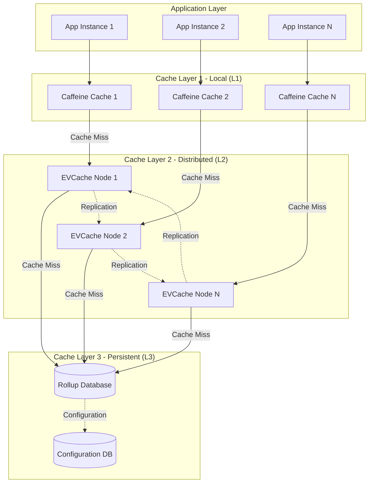

### Cache Performance Characteristics
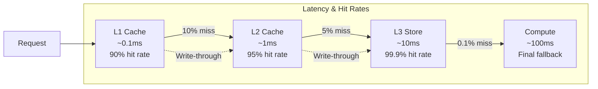

---

## Implementation Details

### Idempotency Handling
```java
@Component
public class IdempotencyManager {
    
    private final EVCacheClient cacheClient;
    private static final String IDEMPOTENCY_PREFIX = "idempotency:";
    private static final Duration TOKEN_TTL = Duration.ofHours(1);
    
    @Autowired
    public IdempotencyManager(EVCacheClient cacheClient) {
        this.cacheClient = cacheClient;
    }
    
    public boolean isDuplicate(String idempotencyToken) {
        String key = IDEMPOTENCY_PREFIX + idempotencyToken;
        return cacheClient.get(key, Long.class).isPresent();
    }
    
    public void markProcessed(String idempotencyToken, long result) {
        String key = IDEMPOTENCY_PREFIX + idempotencyToken;
        cacheClient.set(key, result, TOKEN_TTL);
    }
    
    public long getCachedResult(String idempotencyToken) {
        String key = IDEMPOTENCY_PREFIX + idempotencyToken;
        return cacheClient.get(key, Long.class)
            .orElseThrow(() -> new IllegalStateException(
                "Expected cached result for token: " + idempotencyToken));
    }
    
    @Async
    public CompletableFuture<Void> cleanupExpiredTokens() {
        // Background cleanup of expired tokens
        return CompletableFuture.runAsync(() -> {
            // Implementation would depend on cache technology
            log.debug("Cleaning up expired idempotency tokens");
        });
    }
}
```

### Idempotency Flow Diagram
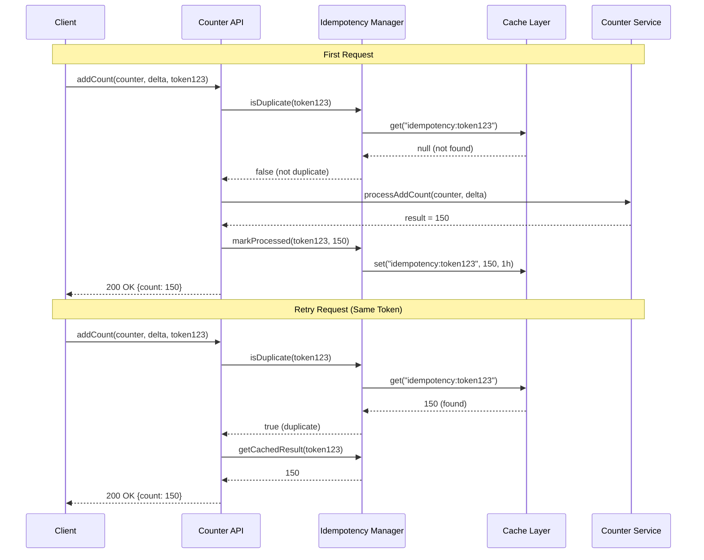

### Dynamic Batching Algorithm
```java
@Component
public class DynamicBatcher {
    
    private static final int MIN_BATCH_SIZE = 10;
    private static final int MAX_BATCH_SIZE = 1000;
    private static final long TARGET_LATENCY_MS = 100;
    private static final int LATENCY_WINDOW_SIZE = 10;
    
    private final AtomicInteger currentBatchSize = new AtomicInteger(MIN_BATCH_SIZE);
    private final CircularFifoQueue<Long> recentLatencies = new CircularFifoQueue<>(LATENCY_WINDOW_SIZE);
    private final ReadWriteLock lock = new ReentrantReadWriteLock();
    
    public int getOptimalBatchSize() {
        lock.readLock().lock();
        try {
            if (recentLatencies.isEmpty()) {
                return MIN_BATCH_SIZE;
            }
            
            double avgLatency = recentLatencies.stream()
                .mapToLong(Long::longValue)
                .average()
                .orElse(TARGET_LATENCY_MS);
            
            int current = currentBatchSize.get();
            
            if (avgLatency > TARGET_LATENCY_MS) {
                // System is slow, reduce batch size
                int newSize = Math.max(MIN_BATCH_SIZE, (int)(current * 0.8));
                currentBatchSize.set(newSize);
                return newSize;
            } else {
                // System is fast, increase batch size
                int newSize = Math.min(MAX_BATCH_SIZE, (int)(current * 1.2));
                currentBatchSize.set(newSize);
                return newSize;
            }
        } finally {
            lock.readLock().unlock();
        }
    }
    
    public void recordLatency(long latencyMs) {
        lock.writeLock().lock();
        try {
            recentLatencies.add(latencyMs);
        } finally {
            lock.writeLock().unlock();
        }
    }
    
    public void resetBatchSize() {
        currentBatchSize.set(MIN_BATCH_SIZE);
        lock.writeLock().lock();
        try {
            recentLatencies.clear();
        } finally {
            lock.writeLock().unlock();
        }
    }
    
    @EventListener
    public void handleSystemOverload(SystemOverloadEvent event) {
        log.warn("System overload detected, resetting batch size");
        resetBatchSize();
    }
}
```

### Dynamic Batching Performance Chart
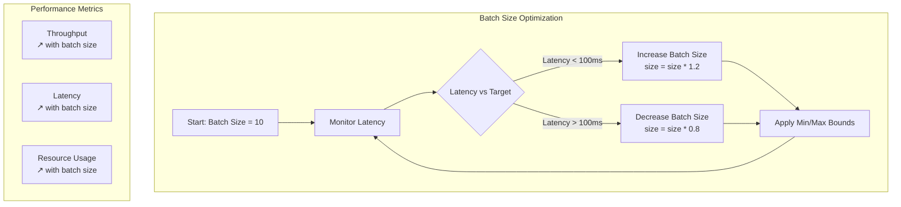

### Time Bucketing Strategy
```java
@Component
public class TimeBucketing {
    
    private static final int DEFAULT_BUCKET_SIZE_MINUTES = 5;
    private static final DateTimeFormatter BUCKET_FORMATTER = 
        DateTimeFormatter.ofPattern("yyyy-MM-dd-HH-mm");
    
    public static String getTimeBucket(Instant timestamp, int bucketSizeMinutes) {
        ZonedDateTime dateTime = timestamp.atZone(ZoneOffset.UTC);
        
        // Round down to the nearest bucket boundary
        int bucketMinute = (dateTime.getMinute() / bucketSizeMinutes) * bucketSizeMinutes;
        
        ZonedDateTime bucketStart = dateTime
            .withMinute(bucketMinute)
            .withSecond(0)
            .withNano(0);
            
        return bucketStart.format(BUCKET_FORMATTER);
    }
    
    public static String getTimeBucket(Instant timestamp) {
        return getTimeBucket(timestamp, DEFAULT_BUCKET_SIZE_MINUTES);
    }
    
    public static String getPartitionKey(String namespace, String counterName, Instant timestamp) {
        String bucket = getTimeBucket(timestamp);
        return String.format("%s:%s:%s", namespace, counterName, bucket);
    }
    
    public static List<String> getTimeBucketsInRange(Instant startTime, Instant endTime, 
                                                    int bucketSizeMinutes) {
        List<String> buckets = new ArrayList<>();
        
        Instant current = getStartOfBucket(startTime, bucketSizeMinutes);
        Instant end = getStartOfBucket(endTime, bucketSizeMinutes);
        
        while (!current.isAfter(end)) {
            buckets.add(getTimeBucket(current, bucketSizeMinutes));
            current = current.plus(Duration.ofMinutes(bucketSizeMinutes));
        }
        
        return buckets;
    }
    
    private static Instant getStartOfBucket(Instant timestamp, int bucketSizeMinutes) {
        ZonedDateTime dateTime = timestamp.atZone(ZoneOffset.UTC);
        int bucketMinute = (dateTime.getMinute() / bucketSizeMinutes) * bucketSizeMinutes;
        
        return dateTime
            .withMinute(bucketMinute)
            .withSecond(0)
            .withNano(0)
            .toInstant();
    }
    
    @Value
    public static class TimeBucket {
        String bucketId;
        Instant startTime;
        Instant endTime;
        
        public boolean contains(Instant timestamp) {
            return !timestamp.isBefore(startTime) && timestamp.isBefore(endTime);
        }
    }
}
```

### Time Bucketing Visualization
```mermaid
gantt
    title Time Bucketing Strategy (5-minute windows)
    dateFormat  HH:mm
    axisFormat %H:%M
    
    section Events Timeline
    Event Stream      :active, events, 14:00, 14:25
    
    section Bucket 1 (14:00-14:05)
    Events Collection :bucket1, 14:00, 14:05
    Bucket Closure    :milestone, close1, 14:05, 0m
    
    section Bucket 2 (14:05-14:10)
    Events Collection :bucket2, 14:05, 14:10
    Bucket Closure    :milestone, close2, 14:10, 0m
    
    section Bucket 3 (14:10-14:15)
    Events Collection :bucket3, 14:10, 14:15
    Bucket Closure    :milestone, close3, 14:15, 0m
    
    section Bucket 4 (14:15-14:20)
    Events Collection :bucket4, 14:15, 14:20
    Bucket Closure    :milestone, close4, 14:20, 0m
    
    section Bucket 5 (14:20-14:25)
    Events Collection :bucket5, 14:20, 14:25
    Bucket Closure    :milestone, close5, 14:25, 0m
```

### Storage Partitioning Strategy
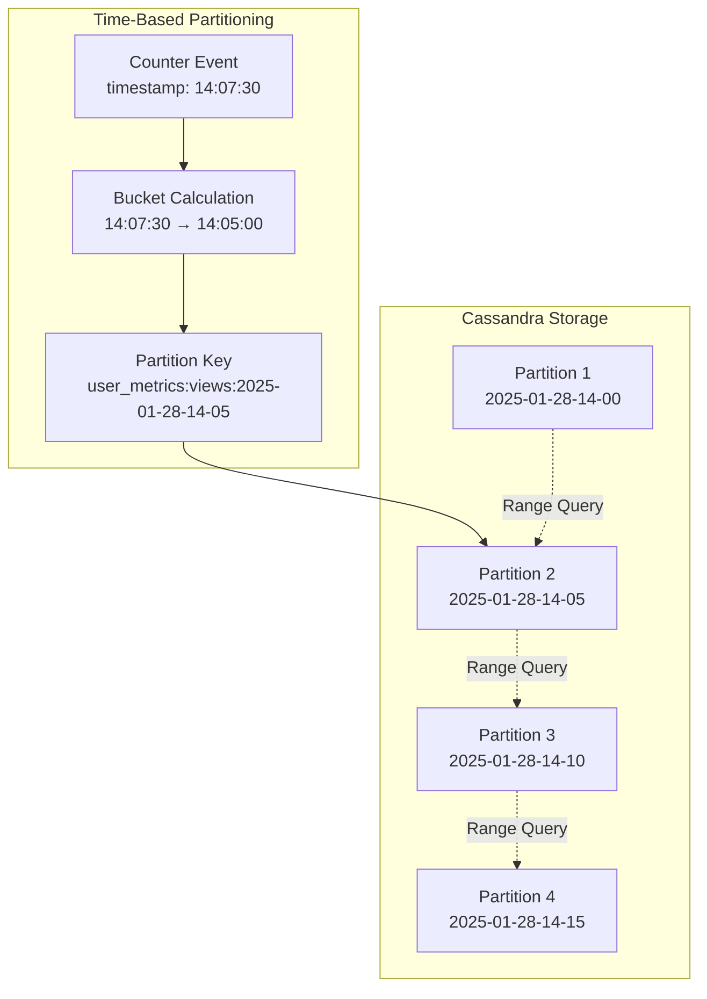

---

## Performance Characteristics

### Latency Breakdown
| Operation | P50 | P99 | P99.9 |
|-----------|-----|-----|-------|
| **AddCount (Regional)** | 1ms | 3ms | 8ms |
| **AddCount (Global)** | 5ms | 12ms | 25ms |
| **GetCount (Cached)** | 1ms | 2ms | 5ms |
| **GetCount (Fresh Rollup)** | 15ms | 40ms | 100ms |

### Throughput Characteristics
- **Regional Counters**: 100K+ RPS per region
- **Global Counters**: 75K+ RPS globally
- **Rollup Pipeline**: 50K counters/second processing
- **TimeSeries Writes**: 200K events/second

### Storage Efficiency
```java
@Component
public class StorageCostAnalyzer {
    
    @Value("${counter.storage.event-size-bytes:100}")
    private int eventSizeBytes;
    
    @Value("${counter.storage.rollup-size-bytes:50}")
    private int rollupSizeBytes;
    
    public StorageCostEstimate calculateStorageCost(long eventsPerDay, int retentionDays) {
        // Raw events cost
        long rawEventStorage = eventsPerDay * eventSizeBytes * retentionDays;
        double rawEventCostPerDay = (rawEventStorage / (1024.0 * 1024 * 1024)) * 0.25; // $0.25/GB
        
        // Rollup storage (assuming 1M unique counters)
        long uniqueCounters = 1_000_000;
        long rollupStorage = uniqueCounters * rollupSizeBytes;
        double rollupCostPerDay = (rollupStorage / (1024.0 * 1024 * 1024)) * 0.25;
        
        // Hybrid approach
        double hybridDaily = rawEventCostPerDay + rollupCostPerDay;
        double hybridAnnual = (rawEventCostPerDay * 7) + (rollupCostPerDay * 365);
        
        return StorageCostEstimate.builder()
            .rawEventsOnly(rawEventCostPerDay * 365)
            .rollupsOnly(rollupCostPerDay * 365)
            .hybridApproach(hybridAnnual)
            .savingsPercent(((rawEventCostPerDay * 365) - hybridAnnual) / (rawEventCostPerDay * 365) * 100)
            .build();
    }
    
    @Data
    @Builder
    public static class StorageCostEstimate {
        private double rawEventsOnly;
        private double rollupsOnly;
        private double hybridApproach;
        private double savingsPercent;
    }
}
```

### Cost Optimization Comparison
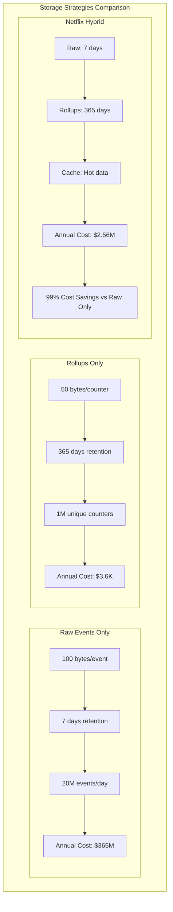

---

## Deployment Architecture & Patterns

### Microservices Deployment Strategy
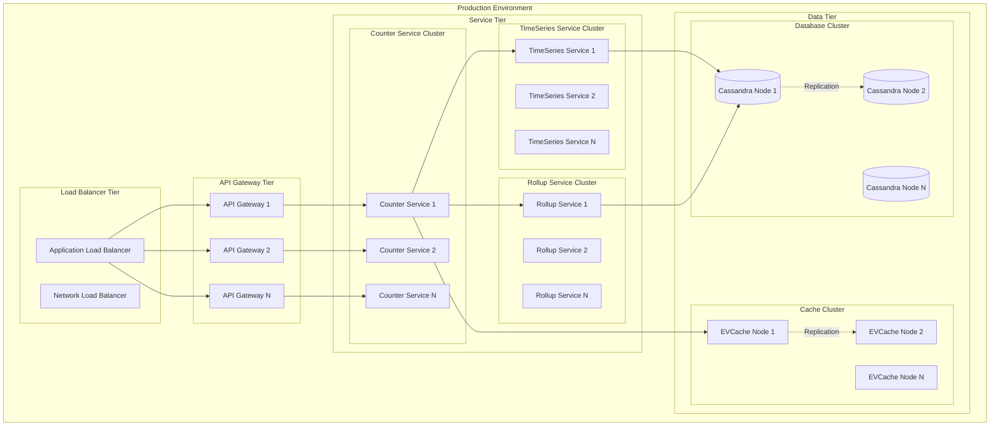

### Service Mesh Architecture
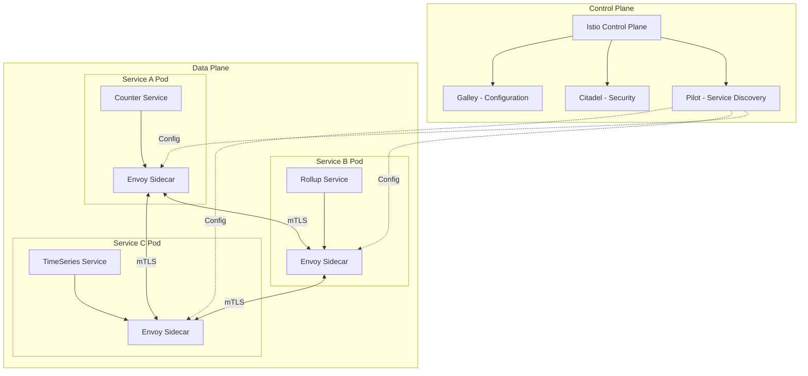

### Circuit Breaker Pattern Implementation
```java
@Component
public class CounterServiceCircuitBreaker {
    
    private final CircuitBreaker circuitBreaker;
    private final CounterService counterService;
    private final FallbackService fallbackService;
    
    @Autowired
    public CounterServiceCircuitBreaker(CounterService counterService,
                                       FallbackService fallbackService) {
        this.counterService = counterService;
        this.fallbackService = fallbackService;
        
        // Configure circuit breaker
        this.circuitBreaker = CircuitBreaker.ofDefaults("counterService");
        circuitBreaker.getEventPublisher()
            .onStateTransition(event -> 
                log.info("Circuit breaker state transition: {}", event));
    }
    
    public long getCount(String counterKey) {
        return circuitBreaker.executeSupplier(() -> {
            return counterService.getCount(counterKey);
        }).recover(throwable -> {
            log.warn("Circuit breaker activated, using fallback for: {}", counterKey);
            return fallbackService.getApproximateCount(counterKey);
        });
    }
    
    public long addCount(String counterKey, long delta, String idempotencyToken) {
        return circuitBreaker.executeSupplier(() -> {
            return counterService.addCount(counterKey, delta, idempotencyToken);
        }).recover(throwable -> {
            log.error("Failed to add count, queuing for retry: {}", counterKey);
            fallbackService.queueForRetry(counterKey, delta, idempotencyToken);
            return fallbackService.getEstimatedCount(counterKey, delta);
        });
    }
}
```

### Auto-Scaling Configuration
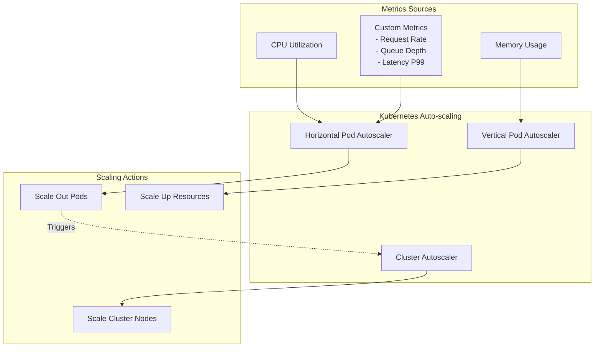

---

## Trade-offs and Design Decisions

### 1. Consistency vs. Latency
```python
class ConsistencyTradeoff:
    def choose_strategy(self, use_case: str) -> str:
        strategies = {
            "ab_testing": "best_effort",  # Speed over accuracy
            "billing": "eventually_consistent",  # Accuracy critical
            "analytics": "eventually_consistent",  # Balance both
            "real_time_dashboard": "cached_with_refresh"  # UX priority
        }
        return strategies.get(use_case, "eventually_consistent")
```

### 2. Memory vs. Durability
**In-Memory Rollup Queues Decision:**
- **Pros**: Lower latency, simpler provisioning, cost-effective
- **Cons**: Risk of data loss during crashes
- **Mitigation**: Frequent counter access triggers re-queuing

### 3. Storage Cost vs. Query Performance
**Hybrid Storage Strategy:**
- **Raw Events**: 7 days retention for debugging/recomputation
- **Rollups**: Long-term retention for queries
- **Cache**: Hot counters for sub-millisecond access

### 4. Centralized vs. Decentralized Control
**Centralized Control Plane Benefits:**
- Configuration consistency across regions
- Easier operational management
- Centralized monitoring and alerting
- Simplified deployment procedures

---

## Operational Excellence

### Monitoring and Alerting
```python
class CounterMetrics:
    def __init__(self):
        self.metrics = {
            "counter_requests_total": Counter(),
            "counter_latency_histogram": Histogram(),
            "rollup_queue_size": Gauge(),
            "idempotency_cache_hit_rate": Gauge(),
            "storage_errors_total": Counter()
        }
        
    def record_request(self, operation: str, latency_ms: float, success: bool):
        self.metrics["counter_requests_total"].labels(
            operation=operation, 
            success=success
        ).inc()
        
        self.metrics["counter_latency_histogram"].labels(
            operation=operation
        ).observe(latency_ms)
```

### Capacity Planning
```python
class CapacityPlanner:
    def estimate_resources(self, requirements: dict) -> dict:
        # Base calculations
        rps = requirements["requests_per_second"]
        cardinality = requirements["unique_counters"]
        retention_days = requirements["retention_days"]
        
        # Storage estimation
        events_per_day = rps * 86400
        storage_gb_raw = events_per_day * 100 / (1024**3)  # 100 bytes per event
        storage_gb_rollups = cardinality * 50 / (1024**3)  # 50 bytes per counter
        
        # Compute estimation
        cpu_cores = max(4, rps // 10000)  # 10K RPS per core
        memory_gb = max(8, cardinality // 100000)  # 100K counters per GB
        
        return {
            "storage": {
                "raw_events_gb": storage_gb_raw * retention_days,
                "rollups_gb": storage_gb_rollups,
                "cache_gb": memory_gb * 0.1
            },
            "compute": {
                "cpu_cores": cpu_cores,
                "memory_gb": memory_gb,
                "instances": max(2, cpu_cores // 8)
            }
        }
```

### Deployment Strategy
1. **Blue-Green Deployments**: Zero-downtime updates
2. **Canary Releases**: Gradual rollout with monitoring
3. **Feature Flags**: Safe experimentation
4. **Circuit Breakers**: Automatic failure isolation

### Disaster Recovery
```python
class DisasterRecovery:
    def backup_strategy(self):
        """Multi-layer backup approach"""
        return {
            "real_time_replication": "Cross-region Cassandra replication",
            "rollup_snapshots": "Daily snapshots to S3",
            "configuration_backup": "Git-based version control",
            "runbook_automation": "Automated recovery procedures"
        }
        
    def recovery_procedures(self):
        """RTO/RPO targets"""
        return {
            "regional_failure": {"rto": "5 minutes", "rpo": "1 minute"},
            "total_data_loss": {"rto": "30 minutes", "rpo": "1 hour"},
            "configuration_corruption": {"rto": "15 minutes", "rpo": "0"}
        }
```

---

## Interview Deep Dive Questions

### System Design Questions

1. **Q: How would you handle a counter that suddenly becomes extremely hot (1M+ RPS)?**
   
   **A: Multi-pronged approach:**
   ```python
   class HotCounterStrategy:
       def handle_hot_counter(self, counter_key: str, current_rps: int):
           if current_rps > 1_000_000:
               # 1. Shard the counter
               shard_count = min(100, current_rps // 10_000)
               self.shard_counter(counter_key, shard_count)
               
               # 2. Use probabilistic counting
               self.enable_probabilistic_counting(counter_key)
               
               # 3. Increase cache layers
               self.add_additional_cache_layers(counter_key)
               
               # 4. Load balancing
               self.redistribute_traffic(counter_key)
   ```

2. **Q: How do you ensure exactly-once semantics in a distributed environment?**
   
   **A: Idempotency tokens + deduplication:**
   ```python
   def process_with_exactly_once(self, request):
       # Check if already processed
       if self.idempotency_cache.exists(request.token):
           return self.idempotency_cache.get(request.token)
           
       # Process atomically
       with self.database.transaction():
           # Check again within transaction
           if self.event_store.exists(request.token):
               return self.get_previous_result(request.token)
               
           result = self.process_request(request)
           self.event_store.write(request.token, result)
           self.idempotency_cache.set(request.token, result)
           
       return result
   ```

3. **Q: How would you migrate from the current system to a new architecture?**
   
   **A: Gradual migration strategy:**
   ```python
   class MigrationStrategy:
       def migrate_to_new_system(self):
           phases = [
               "1. Deploy new system alongside old",
               "2. Dual-write to both systems", 
               "3. Gradually route reads to new system",
               "4. Validate data consistency",
               "5. Stop writes to old system",
               "6. Decommission old system"
           ]
           
           # Shadow traffic for validation
           self.enable_shadow_traffic(percentage=10)
           self.compare_results_continuously()
   ```

### Technical Deep Dive Questions

4. **Q: Explain the rollup pipeline's back-pressure mechanism.**
   
   **A: Adaptive batching with feedback loop:**
   ```python
   class BackPressureManager:
       def adjust_processing_rate(self):
           current_latency = self.measure_processing_latency()
           queue_depth = self.get_queue_depth()
           
           if current_latency > self.target_latency:
               # Slow down processing
               self.batch_size = max(self.min_batch, 
                                   int(self.batch_size * 0.8))
               self.processing_delay += 10  # ms
           elif queue_depth < self.low_watermark:
               # Speed up processing
               self.batch_size = min(self.max_batch,
                                   int(self.batch_size * 1.2))
               self.processing_delay = max(0, self.processing_delay - 5)
   ```

5. **Q: How do you handle clock skew in distributed event ordering?**
   
   **A: Logical timestamps + event ordering:**
   ```python
   class LogicalClock:
       def __init__(self):
           self.counter = 0
           
       def get_timestamp(self, wall_clock_time: int) -> tuple:
           self.counter += 1
           return (wall_clock_time, self.counter, self.node_id)
           
       def compare_events(self, event1, event2) -> int:
           # Use (wall_time, logical_counter, node_id) for ordering
           return (event1.timestamp > event2.timestamp) - (event1.timestamp < event2.timestamp)
   ```

### Scaling and Performance Questions

6. **Q: How would you optimize for a workload with 90% reads and 10% writes?**
   
   **A: Read-optimized architecture:**
   ```python
   class ReadOptimizedCounter:
       def __init__(self):
           # Multi-tier caching
           self.l1_cache = LRUCache(size=10000)  # In-memory
           self.l2_cache = RedisCluster()        # Distributed
           self.l3_cache = CassandraCache()      # Persistent
           
       def get_count(self, key: str) -> int:
           # Check caches in order
           for cache in [self.l1_cache, self.l2_cache, self.l3_cache]:
               if key in cache:
                   return cache.get(key)
                   
           # Fallback to authoritative source
           return self.compute_from_events(key)
   ```

7. **Q: Design a counter system for a social media platform with billions of users.**
   
   **A: Hierarchical counter architecture:**
   ```python
   class SocialMediaCounters:
       def __init__(self):
           self.user_counters = ShardedCounter(shards=1000)     # Per user
           self.post_counters = ShardedCounter(shards=10000)    # Per post
           self.global_counters = EventuallyConsistent()       # Global stats
           
       def like_post(self, user_id: str, post_id: str):
           # Multiple counter updates
           self.post_counters.increment(f"likes:{post_id}")
           self.user_counters.increment(f"likes_given:{user_id}")
           self.global_counters.increment("total_likes")
           
           # Async aggregations for analytics
           self.analytics_pipeline.enqueue({
               "event": "like",
               "user_id": user_id,
               "post_id": post_id,
               "timestamp": time.time()
           })
   ```

---

## Alternative Approaches

### 1. CRDT-Based Counters
```python
class CRDTCounter:
    def __init__(self, node_id: str):
        self.node_id = node_id
        self.counters = defaultdict(int)  # per-node counters
        
    def increment(self, delta: int = 1):
        self.counters[self.node_id] += delta
        
    def merge(self, other: 'CRDTCounter'):
        for node_id, value in other.counters.items():
            self.counters[node_id] = max(self.counters[node_id], value)
            
    def value(self) -> int:
        return sum(self.counters.values())
```

**Pros**: Strong eventual consistency, partition tolerance
**Cons**: More complex, higher storage overhead

### 2. Blockchain-Based Counters
```python
class BlockchainCounter:
    def __init__(self):
        self.blockchain = Blockchain()
        
    def increment(self, counter_id: str, delta: int, signature: str):
        transaction = CounterTransaction(
            counter_id=counter_id,
            delta=delta,
            timestamp=time.time(),
            signature=signature
        )
        self.blockchain.add_transaction(transaction)
```

**Pros**: Immutable audit trail, byzantine fault tolerance
**Cons**: High latency, energy consumption, complexity

### 3. Stream Processing Architecture
```python
class StreamCounter:
    def __init__(self):
        self.kafka_streams = KafkaStreams()
        self.state_store = RocksDB()
        
    def setup_topology(self):
        topology = self.kafka_streams.topology()
        
        topology.add_source("counter-events", "counter-topic") \
               .add_processor("counter-aggregator", CounterAggregator()) \
               .add_sink("counter-results", "results-topic")
```

**Pros**: Real-time processing, fault tolerance, scalability
**Cons**: Complex operational overhead, eventual consistency

---

## Production Considerations

### Security
```python
class SecurityLayer:
    def authenticate_request(self, request):
        """mTLS + JWT validation"""
        certificate = self.extract_client_certificate(request)
        if not self.validate_certificate(certificate):
            raise AuthenticationError("Invalid certificate")
            
        token = self.extract_jwt_token(request)
        if not self.validate_jwt(token):
            raise AuthenticationError("Invalid token")
            
    def authorize_operation(self, user_id: str, namespace: str, operation: str):
        """Fine-grained authorization"""
        permissions = self.get_user_permissions(user_id)
        required_permission = f"{namespace}:{operation}"
        
        if required_permission not in permissions:
            raise AuthorizationError(f"User {user_id} lacks permission {required_permission}")
```

### Cost Optimization
```python
class CostOptimizer:
    def optimize_storage(self):
        """Lifecycle policies for different data tiers"""
        policies = {
            "hot_data": {
                "tier": "SSD",
                "retention": "7 days",
                "cost_per_gb": "$0.25"
            },
            "warm_data": {
                "tier": "HDD", 
                "retention": "90 days",
                "cost_per_gb": "$0.10"
            },
            "cold_data": {
                "tier": "S3",
                "retention": "2 years",
                "cost_per_gb": "$0.02"
            }
        }
        
    def auto_scaling_strategy(self):
        """Right-size resources based on usage patterns"""
        return {
            "scale_up_threshold": "CPU > 70% for 5 minutes",
            "scale_down_threshold": "CPU < 30% for 15 minutes",
            "min_instances": 2,
            "max_instances": 100,
            "scale_factor": 1.5
        }
```

### Data Governance
```python
class DataGovernance:
    def setup_retention_policies(self):
        """GDPR/CCPA compliance"""
        return {
            "user_data": "Delete after 30 days of account deletion",
            "analytics_data": "Aggregate and anonymize after 90 days",
            "audit_logs": "Retain for 7 years for compliance",
            "debug_data": "Delete after 30 days"
        }
        
    def privacy_controls(self):
        """User privacy features"""
        return {
            "data_export": "Provide user data dump in JSON format",
            "data_deletion": "Complete removal within 30 days",
            "anonymization": "Remove PII while preserving analytics value"
        }
```

---

## Lessons Learned

### 1. Start Simple, Evolve Complexity
Netflix didn't build the full system overnight. They started with simple counters and evolved:
- **Phase 1**: Basic Cassandra counters
- **Phase 2**: Added caching layer
- **Phase 3**: Introduced event logging
- **Phase 4**: Built rollup pipeline
- **Phase 5**: Unified API abstraction

### 2. Observability is Critical
```python
class ObservabilityStrategy:
    def __init__(self):
        self.metrics = ["latency", "throughput", "error_rate", "queue_depth"]
        self.alerts = ["SLO violations", "anomaly detection", "capacity warnings"]
        self.dashboards = ["operational", "business", "debugging"]
        
    def implement_observability(self):
        # Three pillars of observability
        return {
            "metrics": "Prometheus + Grafana",
            "logs": "ELK Stack with structured logging", 
            "traces": "Jaeger for distributed tracing"
        }
```

### 3. Operational Simplicity Matters
- **Fewer moving parts** = easier to operate
- **Standardized deployment** across all components
- **Automated remediation** for common issues
- **Clear escalation paths** for complex problems

### 4. Plan for Multiple Failure Modes
```python
class FailureScenarios:
    def __init__(self):
        self.scenarios = {
            "single_node_failure": "Graceful degradation",
            "regional_outage": "Cross-region failover",
            "database_corruption": "Restore from backups",
            "cache_invalidation": "Rebuild from source",
            "network_partition": "Eventually consistent recovery",
            "human_error": "Automated rollback procedures"
        }
```

### 5. Configuration as Code
All system configuration should be:
- **Version controlled**: Track all changes
- **Peer reviewed**: Prevent misconfigurations  
- **Tested**: Validate before deployment
- **Rolled back**: Quick recovery from issues

---

## Conclusion

Netflix's Distributed Counter system represents a masterclass in distributed systems design, showcasing how to balance competing requirements of scale, latency, consistency, and cost. The key insights are:

1. **No single solution fits all use cases** - Different counting strategies for different requirements
2. **Layered abstractions** hide complexity while maintaining flexibility
3. **Operational excellence** is as important as technical design
4. **Evolution over revolution** - Build incrementally, learn continuously
5. **Monitoring and observability** are first-class concerns, not afterthoughts

The system successfully handles 75,000+ requests per second with single-digit millisecond latency while maintaining high availability and eventual consistency. This makes it suitable for mission-critical applications at Netflix scale.

For interview preparation, focus on understanding the trade-offs, being able to explain the architectural decisions, and demonstrating how you would adapt the design for different requirements or constraints.

The Netflix approach provides a blueprint for building similar systems in other domains - whether you're tracking financial transactions, IoT sensor data, or user engagement metrics at scale.
