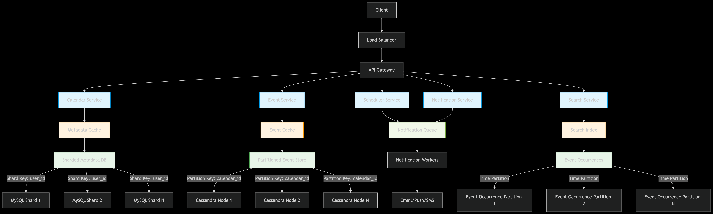
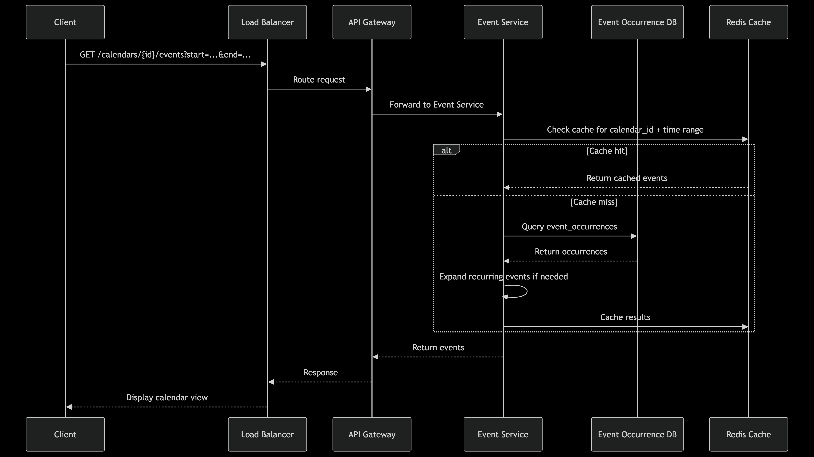
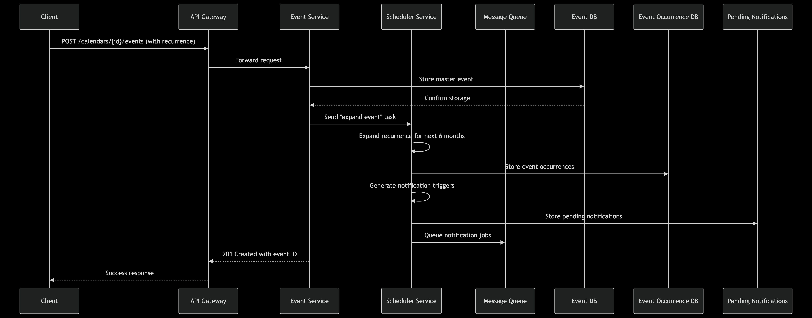
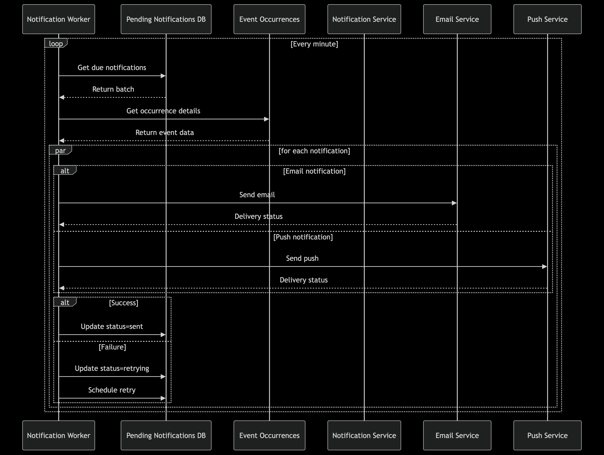

API Endpoints
Calendar Service
POST /calendars - Create new calendar

GET /calendars - List user calendars

GET /calendars/{calendarId} - Get calendar details

PUT /calendars/{calendarId} - Update calendar

DELETE /calendars/{calendarId} - Delete calendar

POST /calendars/{calendarId}/share - Share calendar

GET /calendars/shared - List shared calendars

Event Service
POST /calendars/{calendarId}/events - Create event (single or recurring)

GET /calendars/{calendarId}/events?start={start}&end={end} - Get events in range

GET /events/{eventId} - Get event details

PUT /events/{eventId} - Update event (with recurrence handling)

DELETE /events/{eventId} - Delete event

GET /events/conflicts?start={start}&end={end} - Check for scheduling conflicts

Notification Service
POST /notifications/preferences - Set notification preferences

GET /notifications/upcoming - Get upcoming notifications

User Service
POST /users - Create user

GET /users/me - Get current user

PUT /users/preferences - Update user preferences

Database Schemas
Metadata Store (MySQL - Sharded by user_id)
CREATE TABLE users (
    user_id BIGINT AUTO_INCREMENT PRIMARY KEY,
    email VARCHAR(255) UNIQUE NOT NULL,
    name VARCHAR(255) NOT NULL,
    timezone VARCHAR(50) DEFAULT 'UTC',
    created_at TIMESTAMP DEFAULT CURRENT_TIMESTAMP
);

CREATE TABLE calendars (
    calendar_id BIGINT AUTO_INCREMENT PRIMARY KEY,
    user_id BIGINT NOT NULL,
    name VARCHAR(255) NOT NULL,
    color CHAR(7) DEFAULT '#3F51B5',
    description TEXT,
    visibility ENUM('private', 'public', 'shared') DEFAULT 'private',
    created_at TIMESTAMP DEFAULT CURRENT_TIMESTAMP,
    FOREIGN KEY (user_id) REFERENCES users(user_id)
);

CREATE TABLE calendar_shares (
    share_id BIGINT AUTO_INCREMENT PRIMARY KEY,
    calendar_id BIGINT NOT NULL,
    user_id BIGINT NOT NULL,
    permission ENUM('view', 'edit', 'owner') NOT NULL,
    created_at TIMESTAMP DEFAULT CURRENT_TIMESTAMP,
    FOREIGN KEY (calendar_id) REFERENCES calendars(calendar_id),
    FOREIGN KEY (user_id) REFERENCES users(user_id),
    UNIQUE KEY (calendar_id, user_id)
);

Event Store (Cassandra - Partitioned by calendar_id)
CREATE TABLE events (
    event_id UUID PRIMARY KEY,
    calendar_id BIGINT,
    title TEXT,
    description TEXT,
    start_time TIMESTAMP,  // First occurrence for recurring events
    end_time TIMESTAMP,
    timezone TEXT,
    recurrence_rule TEXT,  // RRULE format
    location TEXT,
    organizer_id BIGINT,
    created_at TIMESTAMP,
    updated_at TIMESTAMP
) WITH CLUSTERING ORDER BY (start_time DESC);

CREATE INDEX ON events (calendar_id);

Attendees Table

event_id (FK)

user_id (FK)

response_status (accepted/declined/tentative)

Event Occurrences (Time-partitioned - Cassandra/ScyllaDB)
CREATE TABLE event_occurrences (
    occurrence_id UUID PRIMARY KEY,
    master_event_id UUID,
    calendar_id BIGINT,
    start_time_utc TIMESTAMP,  // Concrete UTC time
    end_time_utc TIMESTAMP,
    is_modified BOOLEAN,
    is_cancelled BOOLEAN,
    title TEXT,                 // Overridden if modified
    description TEXT,           // Overridden if modified
    location TEXT,              // Overridden if modified
    reminders LIST<INT>         // Minutes before to notify [5, 15, 1440]
) WITH COMPACTION = {
    'class': 'TimeWindowCompactionStrategy',
    'compaction_window_unit': 'DAYS',
    'compaction_window_size': 1
};

Notifications (Time-partitioned - Cassandra/ScyllaDB)
CREATE TABLE pending_notifications (
    notification_id UUID PRIMARY KEY,
    occurrence_id UUID,
    trigger_time TIMESTAMP,    // When to send notification
    user_id BIGINT,
    notification_type TEXT,    // email/push/sms
    status TEXT,               // pending/sent/failed/retrying
    retry_count INT,
    next_attempt TIMESTAMP
) WITH CLUSTERING ORDER BY (trigger_time ASC);

Request Flow Diagrams
1. View Calendar Flow

2. Create Recurring Event Flow

3. Notification Delivery Flow

Key Design Decisions
Event Occurrences Precomputation:

Precompute occurrences for rolling window (3-12 months)

Store in time-partitioned database for fast range queries

Background worker for generating/updating occurrences

Notification Optimization:

Store notification triggers with event occurrences

Time-partitioned pending notifications table

Batched processing with exponential backoff

Sharding Strategy:

Metadata: Shard by user_id

Events: Partition by calendar_id

Occurrences: Time-based partitioning

Caching Strategy:

Calendar metadata: Redis cache with 5 min TTL

Event occurrences: Local cache + Redis with 15 min TTL

Hot calendars: Longer cache duration with write-through

Conflict Resolution:

Optimistic locking with version numbers

CRDTs for offline conflict resolution

Time-based conflict detection during occurrence generation

Scalability Features:

Stateless API services

Sharded databases

Partitioned event storage

Asynchronous processing for non-critical paths

Read replicas for metadata database

This design provides a comprehensive blueprint for implementing a scalable calendar system that can handle Google-scale traffic while maintaining performance and reliability. The precomputation of event occurrences is central to achieving low-latency reads and efficient notification delivery.