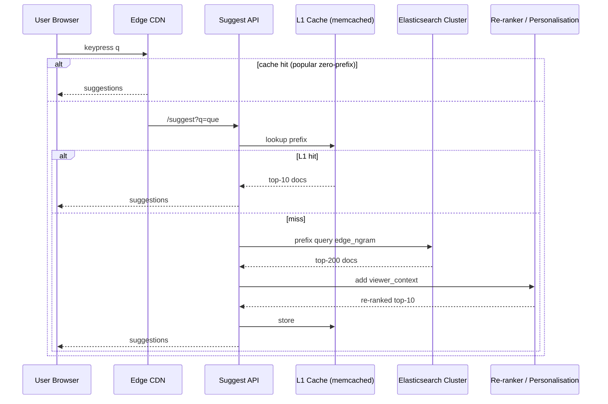

# LinkedIn Typeahead Search – System Design Reference

> Prepared 17 Jun 2025 by Cascade AI. Captures a principal-level design for low-latency, large-scale typeahead (prefix) suggestions across LinkedIn entities: People, Companies, Jobs, Groups, Schools, Skills, etc.

---
## 1 Problem Statement
Provide instant suggestions while the member types in the global search bar or entity-specific pickers (e.g., messaging @-mentions). Results must update every keystroke (≤50 ms p95), incorporate personalization signals (1st/2nd degree connections, past clicks), and reflect near-real-time updates to the index (profile edits, new companies).

---
## 2 Requirements
### 2.1 Functional
1. Prefix-based suggestions after ≥1 character.
2. Support multiple verticals (people, jobs, companies, groups, posts) with universal & scoped search.
3. Personalization & ranking (connection graph, geo, language, popularity).
4. Fuzzy tolerance (diacritics, minor typos).
5. Near-real-time indexing (<1 min lag) for selected entities (people, jobs).
6. Multi-language & locale awareness.
7. Abuse protection (rate-limit, spam filtering, privacy).

### 2.2 Non-Functional
* **Latency**: ≤50 ms p95 server time (ex-US), ≤100 ms total RTT.
* **Throughput**: 250 K QPS peak globally.
* **Availability**: 99.99 %.
* **Freshness**: <60 s for critical updates; hourly for cold entities.
* **Scalability**: 1 B member profiles, 60 M companies, 20 M jobs, 2 B skills/keywords.
* **Privacy & ACL**: Respect blocked profiles, private mode.

---
## 3 Capacity Estimation
| Metric | Value |
|--------|-------|
| Active users | 400 M/day |
| Avg queries/user/day | 5 |
| QPS (average) | 23 K |
| QPS (peak ×10) | 230 K |
| Avg suggestion payload | 500 B (10 results × 50 B JSON each) |
| Outbound BW peak | 115 MB/s |
| Index size | 1 B people × 100 B doc ≈ 100 GB; others add ~40 GB; replicas ×3 ⇒ 420 GB |

---
## 4 High-Level Architecture
```
             ┌──────────────┐   TLS   ┌─────────────────┐
Browser/App ─▶  Edge CDN    ├────────▶  Suggest API     │
             └──────────────┘          (gRPC/REST)      │
                                            │
                                 ┌──────────▼───────────┐
                                 │  Typeahead Service   │
                                 │  (Stateless pods)    │
                                 └────────┬─────────────┘
                        L1 Cache (memcached)|
                         prefix→result list │
                                            ▼
                              ┌────────────────────┐
                              │   Query Router     │
                              │  (shard picker)    │
                              └─▲─────┬─────▲──────┘
            consistent hash ┌──┘     │     └───┐ consistent hash
                           ▼          ▼         ▼
                 ┌────────────┐ ┌────────────┐ ┌────────────┐
                 │  Search    │ │  Search    │ │  Search    │  … N shards
                 │  Node 0    │ │  Node 1    │ │  Node N    │
                 └────────────┘ └────────────┘ └────────────┘
                        ▲                 ▲               ▲
             async fan-in│        gRPC/Binary proto       │
                        ▼                 ▼               ▼
                 ┌──────────────────────────────────────────┐
                 │  Aggregator (top-K merge, ranking)       │
                 └──────────────────────────────────────────┘
```
* **Edge CDN / Fastly**: caches “zero-prefix” popular suggestions; handles global routing.
* **Typeahead Service**: thin stateless layer – auth, throttling, AB flags, fetch from L1 in-memory cache or route to search shards.
* **Search Shards**: custom Trie / Finite State Transducer (FST) per locale, backed by RocksDB or Lucene. Sharded by hash(name_prefix).
* **Aggregator** merges shard responses, applies ML ranking, de-dupes, serialises to JSON.

---
## 5 Indexing Pipeline
1. **Source Events**: Kafka topics for profile edits, new jobs, company changes.
2. **Real-time Persister**: Flink/Beam job computes derived fields (lowercase tokens, n-grams) → writes to **Delta Index** (HBase or DocStore).
3. **Incremental Loader** on each search node watches Delta stream via “tailer”; updates in-memory FST without full rebuild (HotSwap FST).
4. **Offline Full Rebuild** nightly in Hadoop → writes new snapshot to HDFS/S3; search nodes roll-over during low-traffic window.

---
## 6 Data Structures & Search Algorithm
### 6.1 Prefix Dictionary
* Minimal-perfect hash of prefix → postings list.
* FST compresses common suffixes giving 3-4× memory savings vs naive trie.
* Stored in mmap file; each node holds ≈4 GB.

### 6.2 Postings Entry
```proto
message Posting {
  uint32 entity_id;
  float  base_score;   // popularity, connections, recency
  uint16 locale_bits;  // language filter
  uint16 flags;        // entity type mask
}
```
### 6.3 Query Flow
1. Lowercase, strip diacritics, normalise (NFKD) → `prefix`.
2. Fetch candidate postings for `prefix` (<=50 K ids).
3. Apply fuzzy filter (Levenshtein ≤1) if <M results.
4. Join with **Personalisation Features** in FeatureStore (connection degree, viewer local city).
5. Compute `final_score = w0*base + w1*degree + w2*geo + w3*click-through rate + w4*freshness`.
6. Return top-K (usually 10) with highlight snippets.

---
## 7 Caching Strategy
* **L1 (memcached)**: key = `viewer_id:prefix`; TTL 30 s; hit ratio ~60 %.
* **Edge CDN**: unauth popular prefixes (“goo”, “ama”) served without personalization.
* **Bloom filters** in shard cache negative results to avoid disk hit.

---
## 8 Scaling & Partitioning
* Entity prefix space hashed to ~200 logical shards; replicated ×3.
* Each physical node hosts multiple shard partitions for multi-tenancy.
* Adaptive query-fanout: route to first R replicas; fall back on error.
* **Write path** (index update) is decoupled via Kafka; search nodes are read-only.

---
## 9 Failure & Degradation
| Component | Fallback |
|-----------|----------|
| Shard down | Router skips; quorum results still OK. |
| All shards unhealthy | Return CDN cached “top searches” list. |
| Personalisation store slow | Use default weights only. |
| Index update backlog | Mark prefix stale; surface banner to SRE dashboard. |

---
## 10 Security & Privacy
* Enforce entity-level ACL in postings filter (blocked, private mode).
* GDPR delete pipeline removes entity within 24 h across indexes.
* Rate-limit by member ID & IP; captcha on abuse.

---
## 11 Observability
* **SLIs**: suggestion latency, error rate, freshness lag, cache hit ratio.
* Distributed tracing (OpenTelemetry) from edge → shard.
* Anomaly detection on query volume spikes (possible bot).

---
## 12 A/B & ML Experimentation
* Flags service (LiExperiment) controls ranking models per cohort.
* Online metrics: CTR (click-through rate), time-to-click.
* Offline training on click & dwell signals stored in Pinot.

---
## 13 Trade-offs & Alternatives
| Area | Option A | Option B | Decision |
|------|----------|----------|----------|
| Index store | ElasticSearch | Custom FST in RocksDB | B – tighter memory, <10 ms lookups. |
| Personalisation | Real-time feature join | Pre-computed top-N per viewer | Hybrid (prefetch for heavy users). |
| Fuzzy match | On-the-fly edit distance | Fuzzy-grams indexed | A (only when needed). |

---
## 14 Future Enhancements
1. **On-device model** to prefetch suggestions client-side, reducing RTT.
2. **Transformer-based reranking** for tail queries.
3. Unified **Knowledge Graph** features (skill-to-job bridging).
4. Global control plane for dynamic shard rebalancing.

---
## 15 Conclusion
The proposed design balances **sub-50 ms latency**, continuous freshness, and personalised ranking at LinkedIn’s scale by combining an in-memory FST-based prefix index, aggressive multi-layer caching, and a decoupled streaming ingestion pipeline. Horizontal sharding with stateless query serving enables near-linear scaling to hundreds of thousands of QPS while maintaining 99.99 % availability.

---
### Simplified Two-Stage Architecture (Elasticsearch + Re-ranker)

*Diagram reflects Elasticsearch retrieval followed by a lightweight personalisation/re-rank stage plus multi-layer caching discussed above.*

---
### Arrow Diagram (Quick View)
```
User Browser
    |
    v
Edge CDN (popular cache)
    |
    v
Suggest API
    |
    |-- cache hit -->  Response (JSON suggestions)
    |
    |-- cache miss --|
    v                |
L1 Cache (memcached) |
    | hit ---------->|
    | miss           |
    v                |
Elasticsearch Cluster (prefix query)
    |
    v
Re-ranker / Personalisation
    |
    v
Store in L1 Cache → Response to User
```
*Simple arrow-based flow showing the main path and cache shortcuts.*
